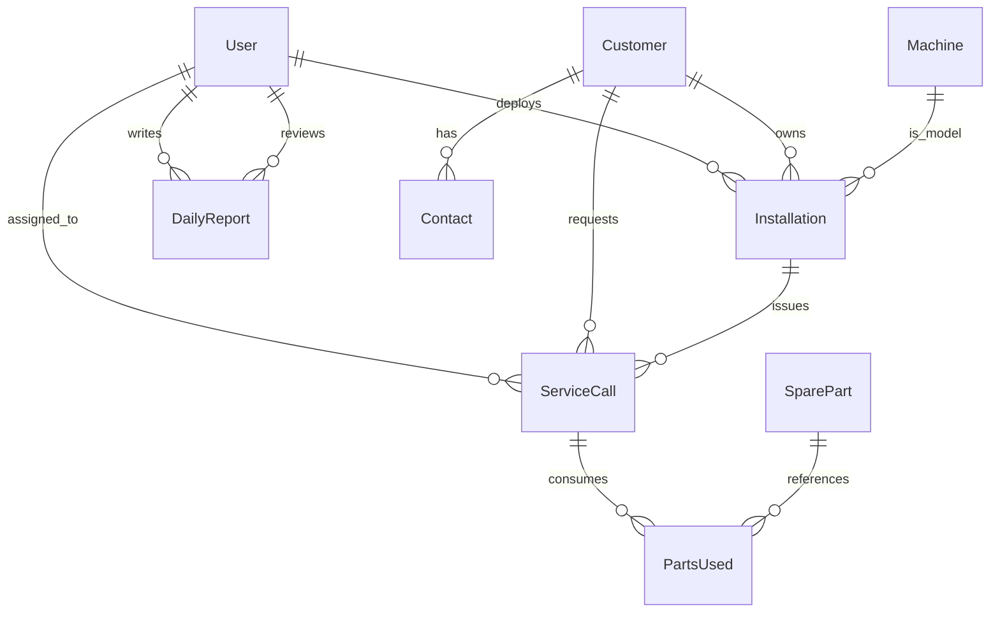

# Database Documentation: BioTrack EMS

This document lists all the database tables, fields, relationships, and constraints in the BioTrack EMS PostgreSQL database managed by Prisma.

---

## 1. Table Definitions

### User Table (`User`)
Stores staff profiles, system roles, and authentication hashes.
*   `id` (Int, PK, Auto): Unique identifier.
*   `email` (String, Unique): Login address.
*   `name` (String): Full name.
*   `password` (String): Hashed password.
*   `role` (Role Enum): System role.
*   `status` (Status Enum, default `ACTIVE`): Account state.

### Customer Table (`Customer`)
Stores client hospitals and clinical accounts.
*   `id` (Int, PK, Auto): Unique identifier.
*   `name` (String): Hospital name.
*   `address` (String): Location address.
*   `district` (String): District name.
*   `state` (String): State name.
*   `pin` (String): Pin code.
*   `gst` (String, Optional): Tax registration ID.

### Contact Table (`Contact`)
Stores point-of-contact details for hospitals.
*   `id` (Int, PK, Auto): Unique identifier.
*   `customerId` (Int, FK): Customer link.
*   `name` (String): Contact name.
*   `designation` (String): Professional title.
*   `phone` (String): Phone number.
*   `email` (String): Email address.

### Machine Table (`Machine`)
Maintains catalog template of manufactured medical devices.
*   `id` (Int, PK, Auto): Unique identifier.
*   `company` (String): Manufacturer brand.
*   `category` (String): Category name (e.g. Ultrasound).
*   `name` (String): Model model series.
*   `model` (String): Technical code.
*   `serialNumber` (String, Unique): Factory serial number.

### Installation Table (`Installation`)
Logs machines configured at customer facilities.
*   `id` (Int, PK, Auto): Unique identifier.
*   `customerId` (Int, FK): Hospital client.
*   `machineId` (Int, FK): Registered catalog model.
*   `installationDate` (DateTime): Deployment date.
*   `warrantyEndDate` (DateTime): End date.
*   `pmIntervalMonths` (Int): Period between PM inspections.
*   `engineerId` (Int, FK, Optional): Assigned tech.

### ServiceCall Table (`ServiceCall`)
Tracks maintenance dispatches and tickets.
*   `id` (Int, PK, Auto): Unique identifier.
*   `callNumber` (String, Unique): Ticket serial code.
*   `customerId` (Int, FK): Hospital ticket.
*   `installationId` (Int, FK): Associated machine.
*   `reportedProblem` (String): Problem description.
*   `status` (CallStatus Enum, default `PENDING`): Ticket state.

### SparePart Table (`SparePart`)
Tracks replacement parts inventory.
*   `id` (Int, PK, Auto): Unique identifier.
*   `partNumber` (String, Unique): Part serial code.
*   `name` (String): Part name.
*   `stock` (Int): Quantity on hand.
*   `minStockLevel` (Int): Minimum threshold alert limit.
*   `unitCost` (Float): Cost price.

### DailyReport Table (`DailyReport`)
Stores daily activity summaries submitted by technicians/sales reps.
*   `id` (Int, PK, Auto): Unique identifier.
*   `userId` (Int, FK): Links to submitting `User`.
*   `date` (DateTime): Date of logging.
*   `workCompleted` (String): Narrative of tasks completed.
*   `problems` (String, Optional): Challenges encountered.
*   `tomorrowPlan` (String): Scheduled objectives.
*   `hospitalVisits` (Json): List of visited hospitals.
*   `meetings` (Json): List of attendees/topics.
*   `calls` (Json): List of consulting calls.
*   `status` (String): Progress status (`PENDING` | `REVIEWED`).
*   `reviewRemarks` (String, Optional): Audit remarks from managers.
*   `reviewedById` (Int, FK, Optional): Links to auditing `User`.

---

## 2. Entity Relationship Diagram (Mermaid)

